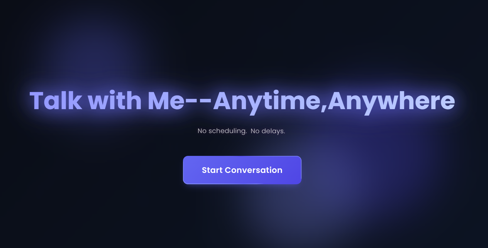

# Mukilan's AI Assistant

A personalized AI chatbot that simulates conversations with Mukilan using natural language processing and voice capabilities. Talk to an AI version of Mukilan anytime, anywhere—no scheduling, no delays.

---

## 🚀 Live Demo

<p>
  <a href="https://homellc-voice-bot-mukilan.onrender.com" target="_blank">
    <button style="
      background-color: #6a0dad;
      border: none;
      color: white;
      padding: 15px 32px;
      text-align: center;
      text-decoration: none;
      display: inline-block;
      font-size: 16px;
      margin: 4px 2px;
      cursor: pointer;
      border-radius: 12px;">
      Try Live Demo
    </button>
  </a>
</p>

You can access the live demo of Mukilan's AI Assistant by clicking the button above or by visiting the following link: [https://homellc-voice-bot-mukilan.onrender.com](https://homellc-voice-bot-mukilan.onrender.com)

---
## Features  

- **Conversational AI:** Powered by Google's Gemini 2.0 Flash model for natural, context-aware responses
- **Voice Interaction:** Both text-to-speech and speech-to-text capabilities for a hands-free experience
- **Personalized Responses:** AI trained on Mukilan's background, experience, and communication style
- **Modern UI:** Clean, responsive interface with attractive animations and visual feedback
- **Offline Capability:** Fallback mechanisms when API services are unavailable

## Prerequisites

- Python 3.8+
- Flask web framework
- Internet connection for API access
- Modern web browser (Chrome, Firefox, Safari, Edge)

## API Keys

This application uses several AI services that require API keys:

- **Google Gemini API:** For conversation generation
- **AssemblyAI:** For speech recognition
- **ElevenLabs** (optional): For high-quality text-to-speech

## 📥 Installation

1. Clone the repository:
   ```
   git clone https://github.com/Mukilan2003/homellc-voice-bot-mukilan.git
   cd homellc-voice-bot-mukilan  
   ```

2. Create a virtual environment and activate it:
   ```
   python -m venv venv
   source venv/bin/activate  # On Windows: venv\Scripts\activate
   ```

3. Install the required dependencies:
   ```
   pip install -r requirements.txt
   ```

4. Configure your API keys by creating/editing `api_key.json`:
   ```json
   {
     "key": "your-gemini-api-key",
     "eleven_labs": "your-elevenlabs-key",
     "deepgram": "your-deepgram-key",
     "assembly_ai": "your-assemblyai-key"
   }
   ```

## Usage

1. Start the Flask application:
   ```
   python app.py
   ```

2. Open your web browser and navigate to:
   ```
   http://127.0.0.1:5000/
   ```

3. Click "Start Conversation" to begin chatting with Mukilan's AI

4. Use the microphone button to speak your questions or type them directly

## Voice Features

- **Text-to-Speech**: AI responses are automatically converted to speech
- **Speech-to-Text**: Click the microphone button and speak to enter your message
- **Voice Controls**: Easily toggle recording on/off with visual feedback

## Technology Stack

- **Backend**: Flask (Python)
- **AI/ML**: Google Gemini 2.0 Flash
- **Speech Recognition**: AssemblyAI
- **Text-to-Speech**: StreamElements API (primary), ElevenLabs (backup)
- **Frontend**: HTML, CSS, JavaScript with modern animations

## Project Structure

- `app.py`: Main Flask application with routes and API integration
- `templates/index.html`: Frontend interface with JavaScript functionality
- `resume_data.json`: Mukilan's profile data for AI personalization
- `api_key.json`: Configuration file for API credentials
- `requirements.txt`: Python dependencies

## Troubleshooting

- **Microphone Issues**: Ensure your browser has permission to access your microphone
- **Missing Audio**: Check that your API keys are correctly configured
- **API Errors**: Some services may have usage limits; check console for error messages

## Summary of Findings

1. System Architecture and Core Functionality
• The backend is developed using Flask, providing API endpoints for chat, voice synthesis, and speech transcription.
• The system leverages Google’s Gemini 2.0 Flash model for generating context-aware responses, ensuring natural and technical accuracy.
• A personalized system prompt is dynamically created from Mukilan’s resume data, incorporating details such as education, experience, projects, and skills.

2. Voice Capabilities and Integration
• Text-to-Speech (TTS) is implemented primarily with the free StreamElements API, with ElevenLabs serving as a high-quality fallback.
• Speech-to-Text (STT) functionality is provided by AssemblyAI, which converts spoken input into text for seamless interaction.
• The design accommodates potential API limitations by incorporating multiple fallback mechanisms for both TTS and STT.

3. Personalization and Response Style
• A dynamic system prompt uses structured data from a JSON file to reflect Mukilan’s professional background and communication style.
• The assistant’s response guidelines ensure concise, conversational, and professional outputs without overly technical or verbose language.
• Instructions within the prompt enforce natural speech patterns by avoiding rigid lists and structured formatting that could disrupt the voice output.

4. Robustness and Efficiency Measures
• API keys are managed via a configuration file (api_key.json), with default placeholders prompting users to supply valid credentials.
• The system employs caching (using lru_cache) for TTS results, minimizing redundant API calls and reducing response latency.
• Fallback strategies ensure continuous operation even if primary services encounter issues, maintaining a reliable user experience.

5. User Interface and Deployment Considerations
• The frontend is built with modern web technologies (HTML, CSS, JavaScript), offering a responsive and intuitive user experience.
• Interactive elements, such as the microphone button, allow users to engage via voice or text.
• Detailed troubleshooting guidelines and prerequisites ensure smooth deployment and operation, even under offline or limited service conditions.

## Author

Mukilan S 
